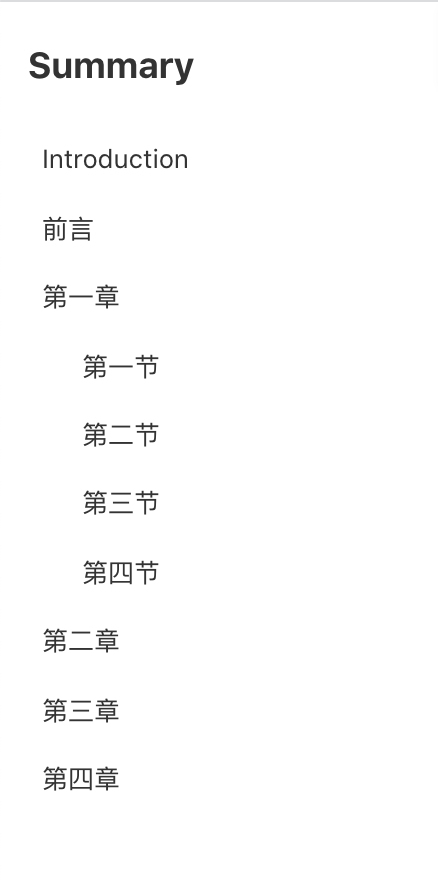

# 目录结构

`SUMMARY.md` 文件，相当于电子书的目录结构；

```markdown
# Summary

* [Introduction](readme.md)
* [前言](readme.md)
* [第一章](part1/readme.md)
    * [第一节](part1/1.md)
    * [第二节](part1/2.md)
    * [第三节](part1/3.md)
    * [第四节](part1/4.md)
* [第二章](part2/readme.md)
* [第三章](part3/readme.md)
* [第四章](part4/readme.md)
```

预览效果如下:



第一行首个 `# xxxxxx` 为当前电子书的名字，显示为页面左上角大标题。

`SUMMARY.md` 就是列表加链接的语法；中括号里是目录的名字，小括号里是路径。

路径为**相对当前html文件**的地址；

也可以在列表内穿插分类标题；

比如当前网站的的 `SUMMARY.md`；

```markdown
# o-book 使用文档

## 如何使用o-book
* [准备](docs/ready.md)
* [初始文件](docs/entrance.md)

## 开始使用
* [设置目录结构](docs/contents.md)
* [写笔记](docs/writeNote.md)

## 发布
* [发布到服务器](docs/uploadServer.md)
* [发布到Github Pages](docs/toGithub.md)

## 其他
* [初始化项目文件，直接下载](docs/initFile.md)
```

预览效果看当前书籍的左侧；